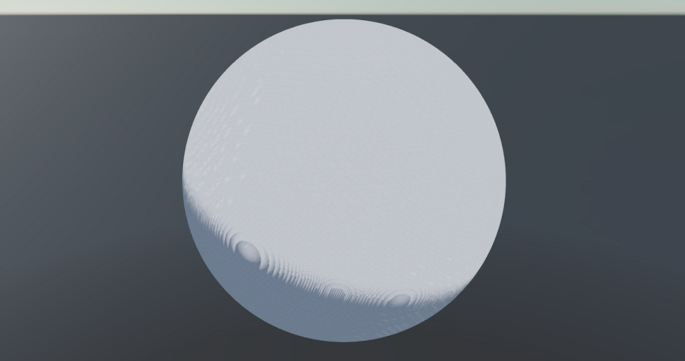
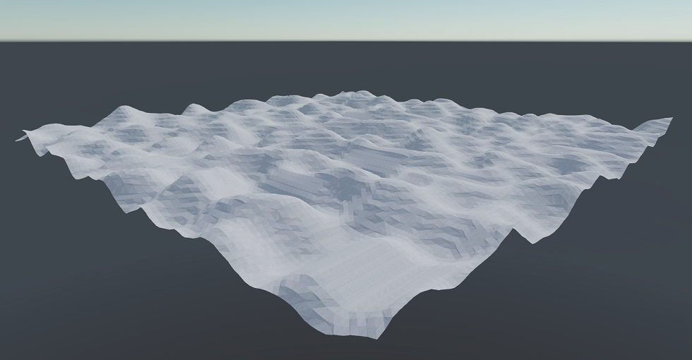

# **Xenko Marching Cubes Terrain**

This is an example project for Marching Cubes terrain in the [Xenko Engine](https://www.xenko.com) built on version 3.1.0.1-beta2-0674 

The texturing method isn't the greatest (currently looping through 3 UV coordinates), a better method would be necessary for real world usage (triplanar mapping or something like that (PRs welcome!)).  

The original implementation is written by Eldemarkki which is available [here](https://github.com/Eldemarkki/Marching-Cubes-Improved).

#### Usage
1) Download / Clone the repo
2) Open the .sln and run

There are a couple of different terrain generation types (found in [DensityGenerator.cs](MarchingCubesImproved/TerrainGen/DensityGenerator.cs)) which can be changed in [Chunk.cs](MarchingCubesImproved/Chunk.cs) on line 68.

You can increase / decrease the world size by changing the worldWidth, worldHeight or worldDepth in [World.cs](MarchingCubesImproved/World.cs) on lines 17-19 (the larger the world the more time it'll take it initially generate).

#### Controls
* `Ctrl + Shift + P` - Toggle Debug stats
* `F1` - Cycle Debug stats page
* `Right Click` - Rotate Camera
* `W A S D` - Move
* `Left Click` - Decrease Density (Remove Terrain)
* `Ctrl + Left Click` - Increase Density (Add Terrain)

#### Screenshots

